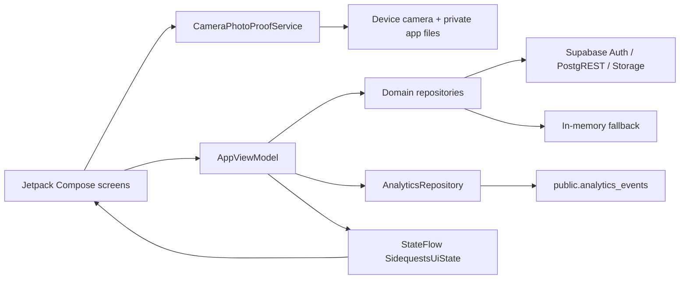

# Architecture draft

This draft uses a compact **MVVM-style presentation structure** plus **Repository** and
device-service boundaries. Android camera/file details stay inside `CameraPhotoProofService`,
while Storage, progress, analytics, authentication, catalogue, and recommendation traffic
use their respective repositories.

## Observer rationale

`AppViewModel` publishes `StateFlow<SidequestsUiState>` and `SidequestsApp` subscribes with `collectAsStateWithLifecycle()`. When actions change state, subscribers are notified and Compose recomposes the affected UI. This gives the Kotlin subgroup a concrete reactive Observer-style flow to explain and refine.

## Why this fits the prototype

- UI and data-source details stay separated.
- A backend/local persistence layer can replace the in-memory repository later.
- One observable state source makes the prototype easy to reason about.
- It stays intentionally small; extra use-case or DI layers can be added only when they solve a real problem.
