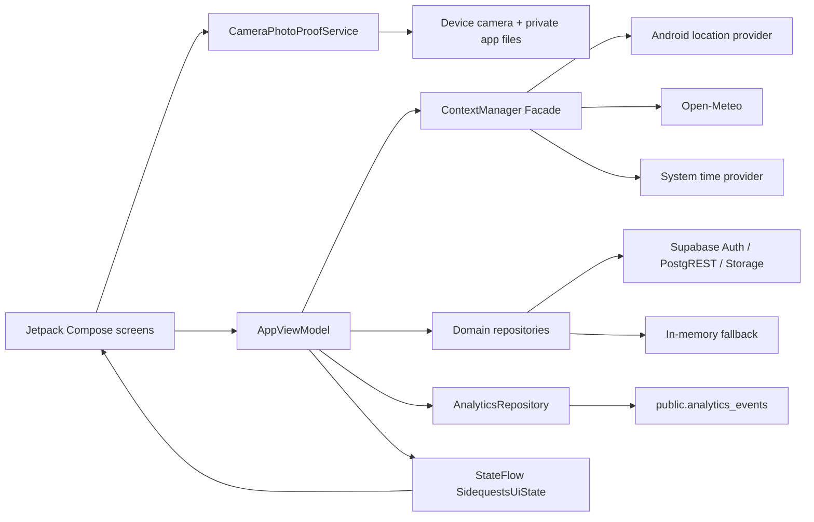

# Architecture draft

```mermaid
flowchart LR
    UI[Jetpack Compose screens] --> VM[AppViewModel]
    UI --> CAMERA[CameraPhotoProofService]
    CAMERA --> DEVICE[Device camera + private app files]
    VM --> CONTEXT[ContextManager Facade]
    CONTEXT --> GPS[Android location provider]
    CONTEXT --> WEATHER[Open-Meteo]
    CONTEXT --> TIME[System time provider]
    VM --> REPO[Domain repositories]
    REPO --> SUPABASE[Supabase Auth / PostgREST / Storage]
    REPO --> LOCAL[In-memory fallback]
    VM --> ANALYTICS[AnalyticsRepository]
    ANALYTICS --> EVENTS[public.analytics_events]
    VM --> STATE[StateFlow SidequestsUiState]
    STATE --> UI
```

This draft uses a compact **MVVM-style presentation structure** plus **Repository** and
device-service boundaries. Android camera/file details stay inside `CameraPhotoProofService`,
while Storage, progress, analytics, authentication, catalogue, and recommendation traffic
use their respective repositories.

## Observer rationale

`AppViewModel` publishes `StateFlow<SidequestsUiState>` and `SidequestsApp` subscribes with `collectAsStateWithLifecycle()`. When actions change state, subscribers are notified and Compose recomposes the affected UI. This gives the Kotlin subgroup a concrete reactive Observer-style flow to explain and refine.

## Why this fits the prototype

- UI and data-source details stay separated.
- A backend/local persistence layer can replace the in-memory repository later.
- One observable state source makes the prototype easy to reason about.
- It stays intentionally small; extra use-case or DI layers can be added only when they solve a real problem.

## Sprint 2 pattern ownership

### Observer — Sebastián Maldonado

The app's reactive UI is implemented through `StateFlow` exposed by `AppViewModel` and observed by Compose with `collectAsStateWithLifecycle()`. This keeps UI rendering decoupled from state mutation and gives Sebastián a concrete Observer-style implementation to justify in the Viva.

### Facade — Julián Ramírez

`ContextManager` acts as the Facade for context acquisition. Consumers request one `UserContext`, while the facade coordinates location, Open-Meteo weather and time providers and returns a single domain object. This hides provider-specific details from recommendation/UI code.

### Factory / Abstract Factory — Lex Betancourt

Factory/Abstract Factory is the assigned Sprint 2 pattern for Lex. The final implementation and rationale should be completed in the photo-proof/sensor integration before the final official-repository merge.
